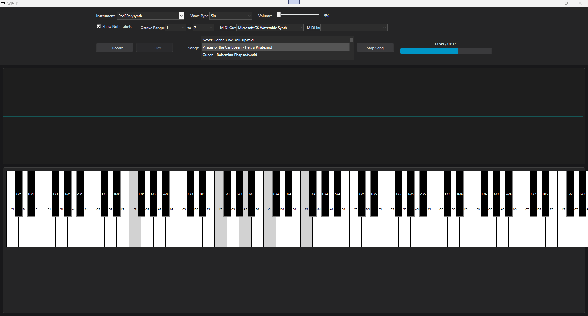

# 🎹 WPF Piano

**WPF Piano** is an enhanced virtual piano built using **C#** and **WPF (.NET 9+)**. It simulates a realistic piano keyboard with features like audio synthesis, MIDI support, waveform selection, note recording/playback, and a live oscilloscope. Designed for hobbyists, music learners, and developers interested in audio DSP and modern UI design.



---

## ✨ Features

- ✅ **Interactive Piano UI** with mouse/touch support
- 🔊 **Waveform Synthesizer**: Sine, Square, Triangle, Sawtooth
- 🎚️ **Wave Volume Control** per waveform
- 🎵 **MIDI In & Out Support**
- 🧠 **Real-Time Oscilloscope Display**
- 📼 **Note Recording & Playback**
- 🎛️ **Octave Range Selector**
- 🎹 Show/hide **Note Labels**
- 🎨 Custom styled UI with dark theme

---

## 🚀 Getting Started

### Requirements

- Windows OS
- [.NET 9 SDK](https://dotnet.microsoft.com/en-us/download/dotnet/9.0)
- Visual Studio 2022 or newer (with WPF and .NET desktop development workloads)

### How to Run

1. Clone the repository:

   ```bash
   git clone https://github.com/andikatjacobdennis/WPF-Piano.git
   cd WPF-Piano
   ```

2. Open the `.sln` file in **Visual Studio 2022+**.

3. Make sure the target framework is set to `.NET 9` and `UseWPF` is enabled in the `.csproj`.

4. Build and run the project (F5 or Ctrl+F5).

---

## 🎛️ Controls Overview

| Control              | Description                                 |
| -------------------- | ------------------------------------------- |
| **Instrument**       | Placeholder for instrument presets (future) |
| **Wave Type**        | Select waveform for audio synthesis         |
| **Wave Volume**      | Adjust the volume for selected waveform     |
| **From/Till Octave** | Define active keyboard range                |
| **MIDI In/Out**      | Select MIDI devices for input/output        |
| **Show Note Labels** | Toggle note names on piano keys             |
| **Record / Play**    | Record and playback custom note sequences   |

---

## 🎵 Usage Tips

* Click or drag across keys to play.
* Use the wave type dropdown and wave volume slider to shape your sound.
* Connect a MIDI controller and select it from **MIDI In** for live input.
* Use **MIDI Out** to send generated notes to an external synth or DAW.
* Press **Start Recording**, play notes, then click **Play Recording** to replay.

---

## 📁 Project Structure

```
WPF-Piano/
├── MainWindow.xaml           # UI layout
├── MainWindow.xaml.cs        # Piano logic, event handlers
├── AudioEngine.cs            # Sound generation (waveforms, ADSR, etc.)
├── MidiHandler.cs            # MIDI input/output
├── Oscilloscope.cs           # Oscilloscope rendering
├── Utils.cs                  # Helper methods
├── Resources/                # Icons, styles, assets
├── WPF-Piano.csproj          # .NET 9 WPF project file
```

---

## 🔧 To Do / Ideas

* 🎚️ Add **master volume control**
* 🎧 Add **polyphony limits** for better CPU usage
* 📈 Improve oscilloscope responsiveness
* 🎼 Export recordings to **MIDI files**
* 📱 Touchscreen optimization for tablets

---

## 🤝 Contributing

Pull requests are welcome! If you have ideas for improvement, bug fixes, or new features, feel free to fork and submit a PR.

---

## 📄 License

MIT License
© [Andikat Jacob Dennis](https://github.com/andikatjacobdennis)

---

## 🙌 Acknowledgments

* Built with love for music and WPF UI design
* MIDI features powered by [NAudio](https://github.com/naudio/NAudio)
* MIDI recording via [DryWetMIDI](https://github.com/melanchall/drywetmidi)
* Inspired by real-world digital pianos and soft synths
